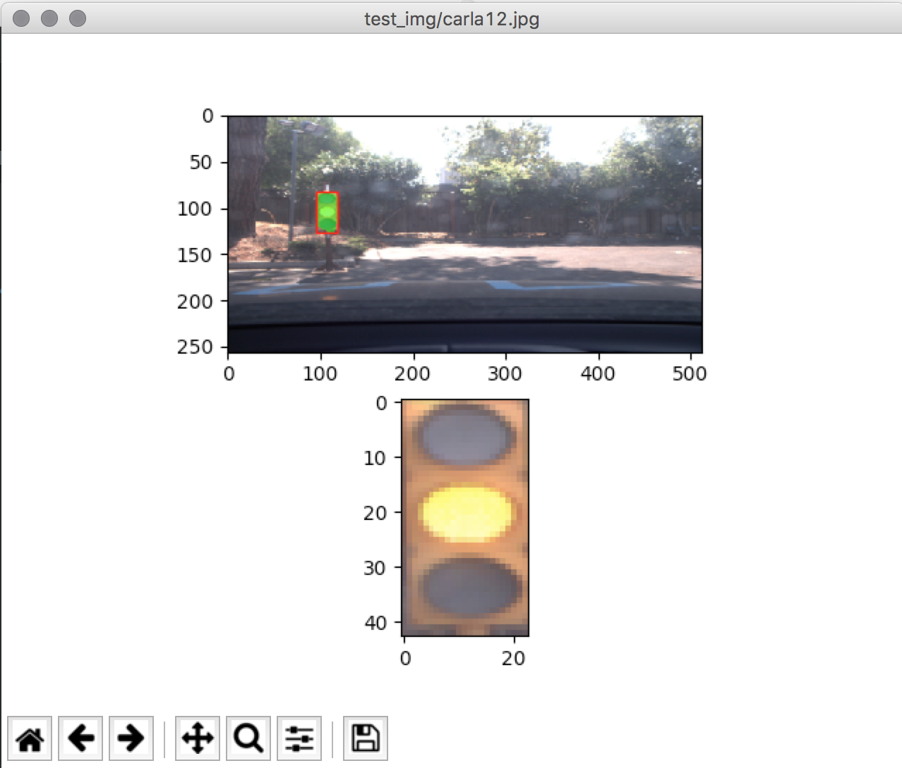
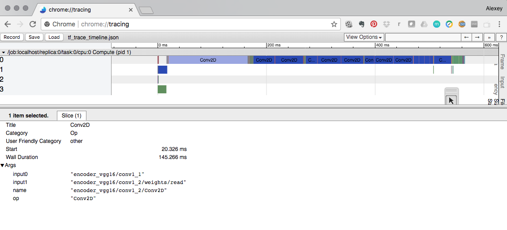

# Traffic Lights detection using Semantic Segmentation

[](https://www.codacy.com/app/Kairos-Automotive/TL-detection-segmentation?utm_source=github.com&utm_medium=referral&utm_content=Kairos-Automotive/TL-detection-segmentation&utm_campaign=badger)

This is a research repo to build and train Fully Convolutional
network able to detect traffic lights in pictures of road scenes.
The goal is to produce a trained tensorflow model able to run on
Udacity's Self-Driving car called
[Carla](https://medium.com/udacity/were-building-an-open-source-self-driving-car-ac3e973cd163)

The model is to be integrated into [carla-brain project](https://github.com/Kairos-Automotive/carla-brain)
if its performance is good enough (both accuracy and runtime.) Only
binary optimised saved model will be deployed
to `carla-brain` for inference. All training and research code is to be
maintained here.


## Architecture

We implement the model in pure tensorflow (version 1.3 -- as installed
on Carla.
We recommend [building tensorflow from sources](https://www.tensorflow.org/install/install_sources)
to fully utilise your hardware capabilities.

For the network architecture we use FCN approach
as per [paper by Shelhamer, Long
and Darrell](https://arxiv.org/pdf/1605.06211.pdf).
Their code can be found
[here](https://github.com/shelhamer/fcn.berkeleyvision.org)


## Training Data

### Cityscapes

First dataset that we use for training is the
[Cityscapes dataset](https://www.cityscapes-dataset.com).
It provides detailed labeled examples of road scene images
from 50 German cities, across all seasons, just daytime in
moderate/good
weather conditions.
It has ground truth labels for 35 classes of
various objects. We are only interested in traffic lights.

Download the data files:
* `gtFine_trainvaltest.zip` (241MB)
* `leftImg8bit_trainvaltest.zip` (11GB)
* `gtCoarse.zip` (1.3GB)
* `leftImg8bit_trainextra.zip` (44GB)

Save them outside of this repo clone, for example
`../cityscapes/data` and unpack zip files in that folder.
You should end up with file tree like this:

```
cityscapes
├── data
│   ├── README
│   ├── gtCoarse
│   │   ├── train
│   │   │   └── aachen
│   │   │       ├── aachen_000000_000019_gtCoarse_color.png
│   │   │       ├── aachen_000000_000019_gtCoarse_instanceIds.png
│   │   │       ├── aachen_000000_000019_gtCoarse_labelIds.png
│   │   │       └── aachen_000000_000019_gtCoarse_polygons.json
│   │   ├── train_extra
│   │   │   └── augsburg
│   │   │       ├── augsburg_000000_000000_gtCoarse_color.png
│   │   │       ├── augsburg_000000_000000_gtCoarse_instanceIds.png
│   │   │       ├── augsburg_000000_000000_gtCoarse_labelIds.png
│   │   │       └── augsburg_000000_000000_gtCoarse_polygons.json
│   │   └── val
│   │       └── frankfurt
│   │           ├── frankfurt_000000_000294_gtCoarse_color.png
│   │           ├── frankfurt_000000_000294_gtCoarse_instanceIds.png
│   │           ├── frankfurt_000000_000294_gtCoarse_labelIds.png
│   │           └── frankfurt_000000_000294_gtCoarse_polygons.json
│   ├── gtFine
│   │   ├── test
│   │   ├── train
│   │   └── val
│   ├── leftImg8bit
│   │   ├── test
│   │   │   └── berlin
│   │   │       └── berlin_000000_000019_leftImg8bit.png
│   │   ├── train
│   │   ├── train_extra
│   │   └── val
│   └── license.txt
```

### Bosch

Second dataset that we use for training is the
[Bosch Small Traffic Lights Dataset](https://hci.iwr.uni-heidelberg.de/node/6132).
It provides labeled bounding boxes around traffic lights
for road scene images in California at day time.

Download RGB data files and extract files from archive
inside this repo under `data/bosch`.
The final directory tree structure
should be like this:
```
data/bosch
├── additional_train.yaml
├── rgb
│   ├── additional
│   │   ├── 2015-10-05-10-52-01_bag
│   │   │   ├── 24594.png
│   │   │   ├── 24664.png
│   │   │   └── 24734.png
│   ├── test
│   │   └── university_run1
│   │       ├── 24068.png
│   │       ├── 24070.png
│   │       ├── 24072.png
...
│   │       └── 40734.png
│   └── train
│       ├── 2015-05-29-15-29-39_arastradero_traffic_light_loop_bag
│       │   ├── 10648.png
...
│           └── 238920.png
├── test.yaml
└── train.yaml
```


## Prepare Training Data

Now we have both full datasets outside this folder.

For training we only take the Cityscapes samples where there are
meaningful images of traffic lights.
Edit and run the following file:
```
python 01_city_copy_tl_data.py
```
This will create `data/cityscapes` folder in this repo and
copy files necessary for training from outside location storing
Cityscapes data.

Then generate label image files which
are grayscale with black background and pixel values of 1 where
we have traffic lights.
```
python 02_city_create_label_imgs.py
```

For Bosch dataset edit and run
```
python 03_bosch_create_label_imgs.py
```

At this point you should see approximately the following picture:
```
$ find data/cityscapes -type f -name '*.json' | wc -l
    8082
$ find data/cityscapes -type f -name '*_labelTrainIds.png' | wc -l
    8082
$ find data/bosch -type f -name '*_labels.png' | wc -l
    4653
```

So we have 12735 images to train on.


## Implementation Notes

[fcn8vgg16.py](fcn8vgg16.py) is the definition of network architecture (as per paper above).
It is using [VGG16](https://arxiv.org/abs/1409.1556) architecture for encoder part of the network.
We use pre-trained VGG16 weights provided by Udacity for initialization before training.
The download happens automatically first time you run training.

[main.py](main.py) is the driver script. It takes most of the inputs from command
line arguments.


## Training

To train the network (includes download of pre-trained VGG16) run:

```
python main.py train --gpu=1 --xla=2 -ep=5 -bs=10 -lr=0.0001
```

Here is an example of script output:
```
I tensorflow/stream_executor/dso_loader.cc:135] successfully opened CUDA library libcublas.so.8.0 locally
I tensorflow/stream_executor/dso_loader.cc:135] successfully opened CUDA library libcudnn.so.6 locally
I tensorflow/stream_executor/dso_loader.cc:135] successfully opened CUDA library libcufft.so.8.0 locally
I tensorflow/stream_executor/dso_loader.cc:135] successfully opened CUDA library libcuda.so.1 locally
I tensorflow/stream_executor/dso_loader.cc:135] successfully opened CUDA library libcurand.so.8.0 locally
TensorFlow Version: 1.0.1
I tensorflow/stream_executor/cuda/cuda_gpu_executor.cc:910] successful NUMA node read from SysFS had negative value (-1), but there must be at least one NUMA node, so returning NUMA node zero
I tensorflow/core/common_runtime/gpu/gpu_device.cc:885] Found device 0 with properties:
name: GeForce GTX 1080 Ti
major: 6 minor: 1 memoryClockRate (GHz) 1.582
pciBusID 0000:01:00.0
Total memory: 10.91GiB
Free memory: 10.40GiB
I tensorflow/core/common_runtime/gpu/gpu_device.cc:906] DMA: 0
I tensorflow/core/common_runtime/gpu/gpu_device.cc:916] 0:   Y
I tensorflow/core/common_runtime/gpu/gpu_device.cc:975] Creating TensorFlow device (/gpu:0) -> (device: 0, name: GeForce GTX 1080 Ti, pci bus id: 0000:01:00.0)
I tensorflow/core/common_runtime/gpu/gpu_device.cc:975] Creating TensorFlow device (/gpu:0) -> (device: 0, name: GeForce GTX 1080 Ti, pci bus id: 0000:01:00.0)
Default GPU Device: /gpu:0
action=train
gpu=1
keep_prob=0.9
batch_size=10
epochs=5
learning_rate=0.0001
I tensorflow/core/common_runtime/gpu/gpu_device.cc:975] Creating TensorFlow device (/gpu:0) -> (device: 0, name: GeForce GTX 1080 Ti, pci bus id: 0000:01:00.0)
I tensorflow/compiler/xla/service/platform_util.cc:58] platform CUDA present with 1 visible devices
I tensorflow/compiler/xla/service/platform_util.cc:58] platform Host present with 4 visible devices
I tensorflow/compiler/xla/service/service.cc:180] XLA service executing computations on platform Host. Devices:
I tensorflow/compiler/xla/service/service.cc:187]   StreamExecutor device (0): <undefined>, <undefined>
I tensorflow/compiler/xla/service/platform_util.cc:58] platform CUDA present with 1 visible devices
I tensorflow/compiler/xla/service/platform_util.cc:58] platform Host present with 4 visible devices
I tensorflow/compiler/xla/service/service.cc:180] XLA service executing computations on platform CUDA. Devices:
I tensorflow/compiler/xla/service/service.cc:187]   StreamExecutor device (0): GeForce GTX 1080 Ti, Compute Capability 6.1
I tensorflow/core/common_runtime/gpu/gpu_device.cc:975] Creating TensorFlow device (/gpu:0) -> (device: 0, name: GeForce GTX 1080 Ti, pci bus id: 0000:01:00.0)
Cityscapes training examples: 6130
Bosch training examples: 4653
total number of training examples: 10783
Train Epoch  1/5 (loss 0.010): 100%|█████████████████████████████████████████████████████████████████████| 1079/1079 [26:18<00:00,  1.30s/batches]
Train Epoch  2/5 (loss 0.004): 100%|█████████████████████████████████████████████████████████████████████| 1079/1079 [26:11<00:00,  1.30s/batches]
...
```

Alternatively you can edit and run `04_train_nohup.sh` which kicks off
the training process in a process that is going to transcend end of
your terminal connection.

The checkpoints are saved to `--ckpt_dir` which defaults to `ckpt`

The summaries are saved to `--summaries_dir` which defaults to `summaries`
You can see training visually by starting [tensorboard](https://www.tensorflow.org/get_started/summaries_and_tensorboard)

```
$ tensorboard --logdir summaries --host 0.0.0.0 --port 8080
```

If you then open tensorboard address `http://192.168.0.1:8080/` in your web browser
you will see
the graph visualisation and training statistics


## Freezing Variables

We can use the trained network saved in `runs/*/model` or we can
run a few
[optimisations for subsequent inference](https://www.tensorflow.org/performance/performance_guide)

First optimization we can do after training is freezing network weights
by converting Variable nodes to constants

```
./05_freeze.sh
```

In our case we have
1859 ops in the input graph and
298 ops in the frozen graph.
In total 38 variables are converted and all the nodes related to
training are pruned. Saved network size falls from 539mb to 137mb.

## Optimizing for Inference

We can further optimize the resulting graph using tensorflow tools.
One such transformation is
[weights quantization](https://www.tensorflow.org/performance/quantization)
To do this we first need to build the graph transform tool
from sources:
```
$ cd ~/dev/tf/tensoflow-r1.3
$ bazel build tensorflow/tools/graph_transforms:transform_graph
```

Then run the transformations (as spelled out in `optimise.sh`)
as follows:

```
$ ./06_optimise.sh
```


## Inference on Test Images

You can run predictions on test images as follows:

```
python main.py predict --gpu=0 --xla=2 --model_dir=frozen_model --file_name=test_img/carla12.jpg
```

You would see at the end of the output:
```
Predicting on image test_img/carla12.jpg
tf call 585 ms, img process 5 ms
```

The 'tf call' is time, in milliseconds, to execute tensorflow `session.run`
 to get the predictions.
'img process' is time, in milliseconds, to superimpose the
segmentation results
over the original image and calculate bounding boxes.




## Tensorflow Profiling

It is possible to turn on timeline profiling when running prediciton
on an image. To do this just use `--trace=True` argument:
```
$ python main.py predict --gpu=0 --model_dir=optimised_model --file_name=test_img/carla2.jpg --trace=True
```

After that there is a file called `tf_trace_timeline.json`
of the *second* call to `tf.run` which
does prediction for the image.
You can open `chrome://tracing`, hit `Load` and point to the json file.
You would see a profiler report similar to:


